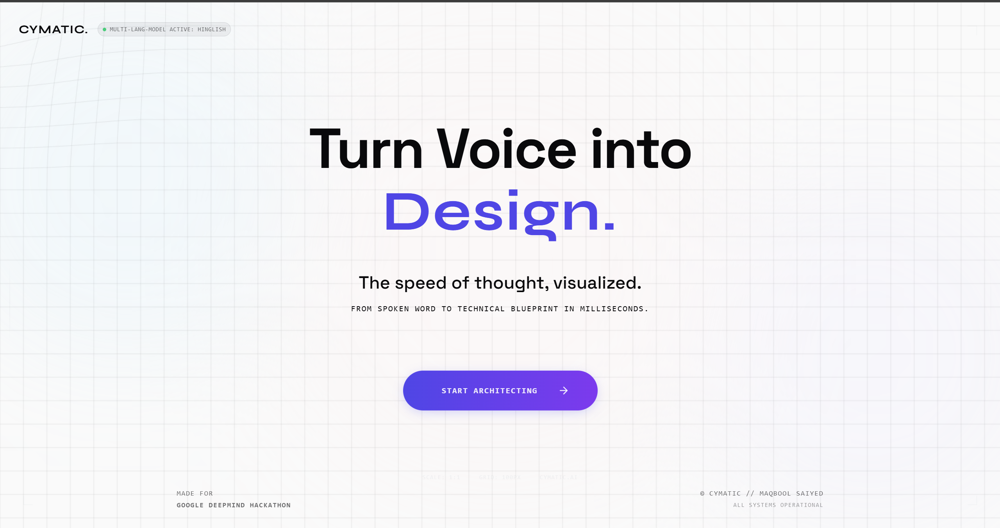

<p align="center">
  <h1 align="center">🎙️ Cymatic</h1>
  <p align="center"><strong>Voice-Powered AI Whiteboard — Speak, and watch your ideas come to life.</strong></p>
</p>

<p align="center">
  
  
  
  
  
</p>

---

<p align="center">
  
</p>

## 🌟 What is Cymatic?

**Cymatic** is an AI-powered whiteboard that transforms your voice into professional diagrams, images, and visual notes — in real time. Just speak (or type), and watch Gemini interpret your intent and render it on an infinite canvas.

Built for the **Google AI Hackathon 2025**, Cymatic showcases the power of Gemini's multimodal capabilities — audio understanding, structured generation, text-to-speech, and image synthesis — all woven into a single, seamless creative tool.

---

## ✨ Features

| Feature | Description |
|---------|-------------|
| 🎙️ **Voice-to-Diagram** | Speak naturally and get production-grade flowcharts, ER diagrams, class diagrams, and more |
| 🔄 **Iterative Editing** | Say "add a forgot password branch" to modify existing diagrams without starting over |
| 🖼️ **Imagen 4 Integration** | Say "generate an image of..." and get AI-generated images placed directly on your canvas |
| 🗣️ **Multilingual TTS** | Gemini responds in the same language you spoke — English, Hindi, French, Hinglish, and more |
| 💡 **Smart Suggestions** | Context-aware, clickable suggestions that analyze your diagram and suggest what's missing |
| ⌨️ **Text Input Fallback** | Type commands when voice isn't an option — full parity with voice features |
| ␣ **Spacebar Shortcut** | Hold Space to record, release to stop — feels instant in demos |
| 📥 **Export to PNG** | One-click export of your canvas to a high-quality PNG |
| 🏷️ **Diagram Type Badge** | Auto-detected diagram type displayed as a sleek pill badge |
| 📝 **Text Notes** | Add sticky notes to your canvas via voice or text |
| 🎨 **Polished Visuals** | Clean, presentation-ready diagrams with varied shapes, colors, and edge labels |

---

## 🏗️ Architecture

```
┌─────────────────────────────────────────────────────┐
│                    Frontend (React)                  │
│  ┌─────────────┐  ┌──────────┐  ┌───────────────┐  │
│  │  Excalidraw  │  │   FAB    │  │  Text Input   │  │
│  │  (Canvas)    │  │ (Record) │  │  (Commands)   │  │
│  └──────┬───────┘  └────┬─────┘  └───────┬───────┘  │
│         │               │                │           │
│         └───────────────┼────────────────┘           │
│                         │                            │
│              ┌──────────▼──────────┐                 │
│              │    API Layer        │                 │
│              │  (api.ts + TTS)     │                 │
│              └──────────┬──────────┘                 │
└─────────────────────────┼───────────────────────────┘
                          │ HTTP
┌─────────────────────────┼───────────────────────────┐
│                  Backend (FastAPI)                    │
│              ┌──────────▼──────────┐                 │
│              │   Routes Layer      │                 │
│              │  /process-audio     │                 │
│              │  /process-text      │                 │
│              │  /tts               │                 │
│              └──────────┬──────────┘                 │
│              ┌──────────▼──────────┐                 │
│              │   GeminiService     │                 │
│              │  ┌───────────────┐  │                 │
│              │  │ Gemini 3 Pro  │  │                 │
│              │  │ (Audio→JSON)  │  │                 │
│              │  ├───────────────┤  │                 │
│              │  │ Flash TTS     │  │                 │
│              │  │ (Text→Speech) │  │                 │
│              │  ├───────────────┤  │                 │
│              │  │ Imagen 4      │  │                 │
│              │  │ (Text→Image)  │  │                 │
│              │  └───────────────┘  │                 │
│              └─────────────────────┘                 │
└──────────────────────────────────────────────────────┘
```

---

## 🤖 AI Models Used

| Model | Purpose | Provider |
|-------|---------|----------|
| [**Gemini 3 Pro**](https://ai.google.dev/gemini-api/docs/models#gemini-3-pro) | Audio understanding, diagram generation (structured JSON), intent detection | Google DeepMind |
| [**Gemini 2.5 Flash TTS**](https://ai.google.dev/gemini-api/docs/models#gemini-2.5-flash-preview-tts) | Multilingual text-to-speech responses (Kore voice) | Google DeepMind |
| [**Imagen 4**](https://ai.google.dev/gemini-api/docs/imagen) (`imagen-4.0-generate-001`) | On-demand image generation from natural language | Google DeepMind |

---

## 🛠️ Tech Stack

### Frontend
| Technology | Version | Purpose |
|------------|---------|---------|
| [React](https://react.dev) | 19.2 | UI framework |
| [Vite](https://vite.dev) | 7.3 | Build tool & dev server |
| [TypeScript](https://typescriptlang.org) | 5.9 | Type safety |
| [Excalidraw](https://excalidraw.com) | 0.18 | Infinite canvas / whiteboard engine |
| [Framer Motion](https://motion.dev) | 12.x | Animations & transitions |
| [Tailwind CSS](https://tailwindcss.com) | 3.4 | Styling |
| [Lucide React](https://lucide.dev) | 0.564 | Icon library |

### Backend
| Technology | Version | Purpose |
|------------|---------|---------|
| [FastAPI](https://fastapi.tiangolo.com) | Latest | REST API framework |
| [Uvicorn](https://uvicorn.org) | Latest | ASGI server |
| [Google GenAI SDK](https://pypi.org/project/google-genai/) | Latest | Gemini & Imagen API client |
| [Pydantic](https://docs.pydantic.dev) | v2 | Request/response validation |
| Python | 3.10+ | Runtime |

### Open Source Libraries
- **[Excalidraw](https://github.com/excalidraw/excalidraw)** — The core whiteboard engine. MIT licensed, used for rendering diagrams, images, and enabling freehand drawing.
- **[Framer Motion](https://github.com/framer/motion)** — Powers all UI animations including the iris-wipe page transition and FAB button states.

---

## 🚀 Getting Started

### Prerequisites
- **Node.js** 18+
- **Python** 3.10+
- **Google AI API Key** — Get one from [Google AI Studio](https://aistudio.google.com/apikey)

### Setup

```bash
# 1. Clone the repo
git clone https://github.com/your-username/cymatic.git
cd cymatic

# 2. Install frontend dependencies
npm install

# 3. Install backend dependencies
pip install -r requirements.txt

# 4. Configure environment
echo "GOOGLE_API_KEY=your_api_key_here" > .env

# 5. Start the backend
uvicorn src.main:app --reload

# 6. Start the frontend (in a new terminal)
npm run dev
```

Open **http://localhost:5173** and start speaking!

---

## 🎬 How to Use

1. **Click the microphone button** (or hold **Spacebar**) to start recording
2. **Speak your diagram request** — e.g., *"Create a flowchart for user authentication"*
3. **Watch it appear** on the canvas with a voice confirmation from Gemini
4. **Click a suggestion** to refine the diagram, or record again to make edits
5. **Type a command** in the text box at the bottom for text-based interaction
6. **Say "generate an image of..."** to create AI images on your canvas
7. **Export** with the 📥 button when you're done

### Supported Diagram Types
- 📊 **Flowcharts** — Process flows, decision trees, workflows
- 🗄️ **ER Diagrams** — Database schemas with entities, attributes, relationships
- 👤 **Use Case Diagrams** — Actor-system interactions
- 🏗️ **Class Diagrams** — OOP hierarchies with inheritance
- 🔄 **Sequence Diagrams** — Component interaction sequences
- 🧠 **Mind Maps** — Brainstorming and idea organization

### Supported Languages
Speak in any language — Gemini will understand and respond in kind:
- 🇬🇧 English
- 🇮🇳 Hindi / Hinglish
- 🇫🇷 French
- And many more (powered by Gemini's multilingual capabilities)

---

## 📁 Project Structure

```
cymatic/
├── src/
│   ├── main.tsx              # React entry point
│   ├── App.tsx               # App shell with landing ↔ canvas routing
│   ├── main.py               # FastAPI entry point
│   ├── features/
│   │   ├── landing/          # Hero page with animated background
│   │   │   ├── Hero.tsx
│   │   │   ├── GeometricConstellations.tsx
│   │   │   ├── WaveformGrid.tsx
│   │   │   └── TransitionOverlay.tsx
│   │   └── canvas/           # Whiteboard workspace
│   │       ├── Canvas.tsx    # Main canvas with all features
│   │       └── FAB.tsx       # Floating action button (mic)
│   ├── routes/
│   │   └── diagrams.py       # API routes (/process-audio, /process-text, /tts)
│   ├── services/
│   │   └── gemini_service.py # Gemini Pro, Flash TTS, Imagen 4 integration
│   └── utils/
│       ├── api.ts            # Frontend API client + TTS preloading
│       └── diagramBuilder.ts # Excalidraw element builder with color palettes
├── tests/                    # API tests
├── index.html
├── package.json
├── requirements.txt
├── vite.config.ts
├── tailwind.config.js
└── .env                      # GOOGLE_API_KEY (not committed)
```

---

## 🔑 API Endpoints

| Method | Endpoint | Description |
|--------|----------|-------------|
| `POST` | `/process-audio` | Upload audio → get diagram JSON + suggestions + TTS text |
| `POST` | `/process-text` | Send text instruction → get diagram JSON + suggestions |
| `POST` | `/tts` | Send text → get base64 audio (Gemini Flash TTS) |

---

## 🙏 Acknowledgments

- **[Google DeepMind](https://deepmind.google)** — Gemini 2.5 Pro, Gemini Flash TTS, and Imagen 4
- **[Excalidraw](https://excalidraw.com)** — The incredible open-source whiteboard that powers our canvas
- **[Vite](https://vite.dev)** & **[React](https://react.dev)** — Lightning-fast frontend tooling
- **[FastAPI](https://fastapi.tiangolo.com)** — High-performance Python API framework

---

<p align="center">
  Built with ❤️ for the <strong>Google AI Hackathon 2025</strong>
</p>
